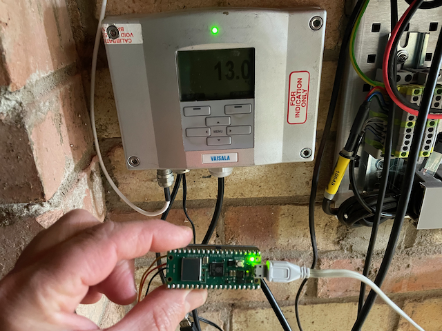

# HMTpico
Collect temperature data from the VCN HMT333 sensor and transmit hourly temperature 
reports (optional) along with a daily max/min report to WoW using a Pi PICO microcontroller
and written in 'Micropython'.

The PICO RTC time is initially synced with an NTP server and subsequently synced daily.
If the WiFi connection is lost during WoW transmission attempts, re-connection is attempted.

WiFi and other settings will be stored in the `settings.py` file in the format:

    SETTINGS = {
        'WIFI-PASSWORD': 'your WiFi password',
        'WOW_SITE_ID': 'your WoW site ID e.g. a23cfea0-4441-eb11-8fed-0003ff595f97',
        'SSID': 'your WiFi SSID',
        'WOW_AUTH_KEY': '123456 - six digits, as setup on the WoW website',
        'REPORTING_SCHED': '3'
    }

The reporting schedule has three options:

    1 = Daily MAX temp reading only at 0900 UTC.
    2 = Daily MAX and MIN temp reading at 0900 UTC.
    3 = Daily MAX and MIN temp reading at 0900 UTC and HOURLY temperature reports
    at HH+50.

Instrument calibration coefficients are stored in the `calibration.py` file in the format:

    CORRECTIONS = {
                    'CORR-30': '0.0',
                    'CORR-20': '0.0',
                    'CORR-10': '0.0',
                    'CORR+0': '0.0',
                    'CORR+10': '0.0',
                    'CORR+20': '0.0',
                    'CORR+30': '0.0',
                    'CORR+40': '0.0',
                    'CORR+50': '0.0'
                }

The 'user setup' facility on startup allows these values to be entered over
serial cable and terminal program. Press the 's' key within 30 seconds at the prompt
and follow the instructions. If no entry is made into the setup routine within
30 seconds, then the device will restart. Terminal program settings: `9600-8-N-1`

A `devapi.py` file with your WoW developer API key should be present with the
other files and contain the following:

    DEV = {
        'API_KEY': 'abc123 - your WoW developer API key',
    }

The current daily Max/Min temp and count of readings made is recorded in a 
temperature file. These readings can be loaded back in (if less than 10 mins
old) to ensure continuity in the event of a machine restart.

